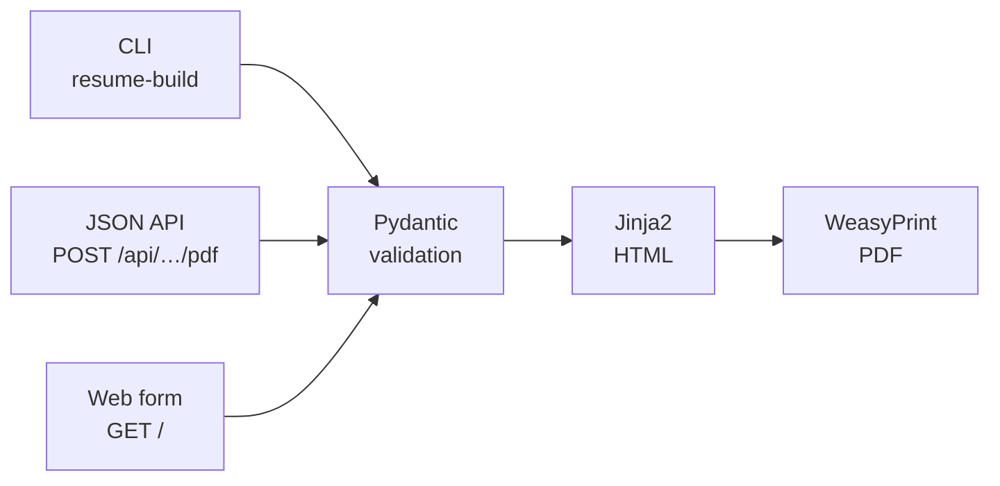

# resume-engine

[](https://github.com/Aalihaidar/resume-engine/actions/workflows/ci.yml)
[](https://github.com/Aalihaidar/resume-engine/actions/workflows/security.yml)
[](https://codecov.io/gh/Aalihaidar/resume-engine)
[](https://scorecard.dev/viewer/?uri=github.com/Aalihaidar/resume-engine)
[](pyproject.toml)
[](LICENSE)

**Data-driven, ATS-safe resume and cover letter builder.** Write your content
once in YAML (or send it as JSON), get a clean single-column PDF that
applicant-tracking systems can parse — from the command line, a JSON API, or a
web form.

**Live demo:** [resume-engine-sud4.onrender.com](https://resume-engine-sud4.onrender.com)
· **API docs:** [`/docs`](https://resume-engine-sud4.onrender.com/docs)



## Features

- **Content separate from design.** Content lives in `data/*.yaml`, layout in
  `src/resume_builder/templates/`. Editing a resume never touches a template,
  so a content change can't break the formatting.
- **One pipeline, three interfaces.** The CLI, the API and the web form all
  call the same render functions and validate against the same models.
- **Validated input.** Pydantic models reject a missing field or wrong type
  with a clear error (API: `422`) instead of producing a broken PDF. A cover
  letter with leftover `[PLACEHOLDER]` text is rejected on purpose.
- **Tailor by toggling, not deleting.** Every resume section has a master
  switch and every entry its own `include:` flag; something renders only when
  both are on.
- **ATS-safe by construction.** Single column — no tables, text boxes or
  floats.
- **Hardened public API.** Request-size limit, strict photo validation
  (type, size, encoding) and path-containment checks, each enforced
  independently.

## Quick start

The fastest route is the **dev container**, which ships every dependency,
including the Pango/Cairo libraries WeasyPrint needs to draw PDFs.

<details open>
<summary><b>VS Code Dev Container</b> (recommended)</summary>

1. `cp .env.example .env` — Docker Compose refuses to start without it
   (nothing inside needs filling in).
2. Open the folder in VS Code with the **Dev Containers** extension installed.
3. **Dev Containers: Reopen in Container** (`Ctrl/Cmd+Shift+P`).
4. Inside the container:

   ```bash
   make render          # → output/resume.pdf
   make cover-letter    # → output/cover_letter.pdf
   ```

Your SSH agent and `~/.gitconfig` are forwarded, so `git` works as on the
host. `.vscode/tasks.json` exposes the Makefile targets as tasks
(`Ctrl+Shift+B` renders the resume), and **Serve API (dev)** starts the web
app on port 8000, which VS Code forwards automatically.

</details>

<details>
<summary><b>Docker Compose</b> (no VS Code)</summary>

```bash
cp .env.example .env
docker compose run --rm app uv run resume-build render
docker compose run --rm app uv run resume-build cover-letter
```

</details>

<details>
<summary><b>Native</b> (Python 3.12+ and <a href="https://docs.astral.sh/uv/">uv</a>)</summary>

Install WeasyPrint's system libraries first — Debian/Ubuntu:
`sudo apt install libpango-1.0-0 libpangocairo-1.0-0 libharfbuzz-subset0`,
macOS: `brew install pango`. On Windows, use the dev container.

```bash
uv sync --group dev
uv run pre-commit install    # optional: run the checks on every commit
make render
```

</details>

## Usage

### CLI

```bash
uv run resume-build render                     # data/resume.yaml → output/resume.pdf
uv run resume-build cover-letter               # data/cover_letter.yaml → output/cover_letter.pdf
uv run resume-build render --data my.yaml --out cv.pdf --html cv.html
uv run resume-build version
```

| Option | Default (`render` / `cover-letter`) | Purpose |
|---|---|---|
| `--data`, `-d` | `data/resume.yaml` / `data/cover_letter.yaml` | Input YAML |
| `--out`, `-o` | `output/resume.pdf` / `output/cover_letter.pdf` | Output PDF |
| `--html` | — | Also save the intermediate HTML for a quick preview |

### Web form

Open `/` on the [live site](https://resume-engine-sud4.onrender.com) or on
`make serve-api` (<http://localhost:8000>). Start from the built-in template,
edit the YAML in the browser (JSON works too — it's valid YAML), and download
the PDF. **Set Photo** handles the image encoding for you.

### JSON API

| Route | Method | Body → response |
|---|---|---|
| `/api/resume/pdf` | `POST` | JSON matching `Resume` → `application/pdf` |
| `/api/cover-letter/pdf` | `POST` | JSON matching `CoverLetter` → `application/pdf` |
| `/healthz` | `GET` | Liveness check → `{"status": "ok"}` |
| `/docs` | `GET` | Interactive OpenAPI documentation |

```bash
# Convert the YAML template to JSON, then render it
uv run python -c "import json, sys, yaml; json.dump(yaml.safe_load(open('data/resume.template.yaml')), sys.stdout)" > resume.json

curl -fsS -X POST https://resume-engine-sud4.onrender.com/api/resume/pdf \
  -H "Content-Type: application/json" \
  --data-binary @resume.json \
  -o resume.pdf
```

Requests are limited to **8 MB**; an invalid payload returns **`422`** with
the validation errors. The free-tier instance sleeps when idle, so the first
request after a while can take 30–60 s.

## Editing content

| File | Start from | Holds |
|---|---|---|
| `data/resume.yaml` | `data/resume.template.yaml` | `contact`, `summary`, `experience`, `projects`, `education`, `skills`, `certifications`, `languages`, `photo` |
| `data/cover_letter.yaml` | `data/cover_letter.template.yaml` | `applicant_name`, `applicant_contact`, `date`, `recipient`, `role_title`, `salutation`, `body_paragraphs`, `closing` |

- **Visibility (resume):** `sections.<name>` is the master switch for a
  section; each entry (job, project, degree, skill group, certification,
  language) has `include: true|false`. Tailor a resume by toggling — nothing
  needs deleting.
- **Cover letter:** rewritten per application (`role_title`, `recipient`,
  `body_paragraphs`). `sections.date` / `sections.recipient` can be turned off
  when that information isn't known.
- **Photo:** either a filename inside `src/resume_builder/static/` (CLI), or a
  `data:image/{png,jpeg,webp};base64,…` URI of at most 3 MB decoded (API and
  web form — the deployed container has no persistent disk).
- **Editor support:** `schema/resume.schema.json` (generated from the
  `Resume` model) gives autocomplete and validation for `resume.yaml` in
  VS Code. Regenerate it with `make schema` after changing `models.py`.

## Development

| Command | Does |
|---|---|
| `make render` / `make render-html` | Resume → `output/resume.pdf` (+ HTML preview) |
| `make cover-letter` / `make cover-letter-html` | Cover letter → `output/cover_letter.pdf` (+ HTML preview) |
| `make serve-api` | API + web form on `:8000` with auto-reload |
| `make lint` / `make format` | Ruff lint + format check / auto-fix |
| `make typecheck` | `mypy --strict` |
| `make test` | pytest with coverage |
| `make spell` | cspell over every tracked file |
| `make audit` | `pip-audit` of `uv.lock` — runtime packages fail, dev tooling warns |
| `make schema` | Regenerate `schema/resume.schema.json` |
| `make ci` | lint + typecheck + test + spell — the checks CI runs |
| `make clean` | Remove build output and caches |

Pre-commit hooks run Ruff, cspell and whitespace fixers, and re-render
`output/resume.pdf` whenever `data/resume.yaml` or a template changes.

### CI/CD and security

Every pull request runs lint, type checks, tests on Python 3.12 and 3.14,
spelling, a JSON Schema drift check, a dependency audit, and a Docker build
with a smoke test of the production image. CodeQL, zizmor, Trivy and OpenSSF
Scorecard report to the repository's code-scanning tab. All GitHub Actions
are pinned to commit SHAs and Docker images to digests, kept current by
Dependabot.

Branching is `feature → develop → main`; both long-lived branches are
protected and PR-only, and `main` accepts pull requests from `develop` only.
Details are in [CONTRIBUTING.md](.github/CONTRIBUTING.md).

## Deployment

Hosted on [Render](https://render.com) (free tier) from the
[`render.yaml`](render.yaml) Blueprint, built from `docker/Dockerfile.prod`.
`autoDeployTrigger: checksPass` deploys `main` only after its CI checks pass.

| | `docker/Dockerfile.dev` | `docker/Dockerfile.prod` |
|---|---|---|
| Used by | Dev container, `docker-compose.yml` | Render, `docker-compose.prod.yml` |
| User | root | non-root (`uid 1000`) |
| Contains | compilers, git, ssh, `gh` | API + web runtime only (no pip, no build tools) |

Run the production image locally:

```bash
docker compose -f docker-compose.prod.yml up --build   # http://localhost:8000
```

## Project layout

```text
.
├── src/resume_builder/
│   ├── models.py          # Pydantic models: Resume, CoverLetter
│   ├── render.py          # YAML/JSON → HTML (Jinja2) → PDF (WeasyPrint)
│   ├── cli.py             # resume-build render | cover-letter | version
│   ├── api.py             # FastAPI app: PDF endpoints + web form
│   ├── middleware.py      # request body-size limit
│   ├── templates/         # resume / cover letter Jinja2 templates + CSS
│   ├── web_static/        # index.html — the web form
│   └── static/            # photos referenced by filename
├── data/                  # resume.yaml, cover_letter.yaml + *.template.yaml
├── schema/                # resume.schema.json (generated)
├── tests/                 # pytest suite
├── scripts/               # schema generator, dependency audit, dev-container entrypoint
├── docker/                # Dockerfile.dev, Dockerfile.prod
├── .github/               # workflows, Dependabot, rulesets docs, issue/PR templates
├── output/                # generated PDFs
├── render.yaml            # Render Blueprint
├── Makefile
└── pyproject.toml / uv.lock
```

## Contributing

Issues and pull requests are welcome — read
[CONTRIBUTING.md](.github/CONTRIBUTING.md) for the branching model, checks
and commit conventions. Report security issues privately as described in
[SECURITY.md](.github/SECURITY.md), not in a public issue.

## License

The source code is released under the [MIT License](LICENSE).

The personal content in this repository — `data/resume.yaml`,
`data/cover_letter.yaml`, the rendered PDFs in `output/` and the photo in
`src/resume_builder/static/` — belongs to Ali Haidar and is **not** covered
by that license; please don't reuse it. The `*.template.yaml` files are free
to use as a starting point.
